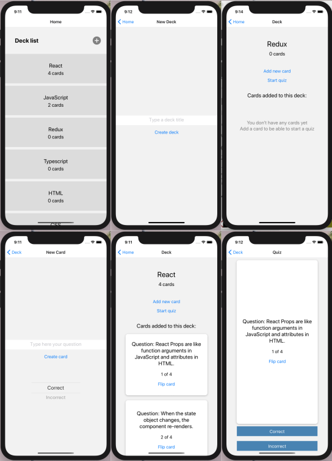

 
# Mobile Flashcards Project  
## Udacity React Developer Nanodegree Project 3 - Introduction

This app is the third project of the Udacity React Developer Nanodegree and follows the "Mobile Flashcards project specification" listed bellow and all the style guides provided by Udacity:
- CSS Style Guide
- HTML Style Guide
- JavaScript Style Guide
- Git Style Guide

## Overview



## Udacity Specification

- For this project I had to build a mobile application (Android or iOS - or both) that allows users to study collections of flashcards. 

- The app allows users to create different categories of flashcards called "decks", add flashcards to those decks, then take quizzes on those decks.
 
## Udacity Requirements

### Application Setup
- [x] The application requires only `yarn install` and `yarn start` to install and launch. 
- [x] A README is included with the project. The README includes a description and clear instructions for installing and launching the project.

### Application Functionality
- [x] The primary view, seen when the app loads, is a list of created decks which includes the name of each deck and the number of cards. 
- [x] Pressing on a deck in the list should generate an animation, and the app should route to an individual deck view.
- [x] The individual deck view includes (at a minimum): 
  - [x] The deck title
  - [x] Number of cards in the deck
  - [x] Option to start a quiz for that deck
  - [x] Option to add a new question to the deck
- [x] Pressing the 'Start a Quiz' or 'Add Card' button properly routes to the correct views for those activities.
- [x] The New Question view includes a form with fields for a question and answer, and a submit button.
- [x] Submitting the form correctly adds the question to the deck.

#### Quiz functionality
- [x] The Quiz view starts with a question from the selected deck.
- [x] The question is displayed, along with a button to show the answer.
- [x] Pressing the 'Show Answer' button displays the answer.
- [x] Buttons are included to allow the student to mark their guess as 'Correct' or 'Incorrect'.
- [x] The view displays the number of questions remaining.
- [x] When the last question is answered, a score is displayed as a percentage of correct answers.
- [x] When the score is displayed, buttons are displayed to either start the quiz over or go back to the Individual Deck view.
- [x] Both the 'Restart Quiz' and 'Back to Deck' buttons route correctly to their respective views.
- [x] The view includes a form for creating a new deck - which should just be an input for the title and a 'Create Deck' button.
- [x] Pressing the button correctly creates the deck and routes the user to the Individual Deck view for the new deck.
- [x] Logic for notification has been implemented. Notifications are generated at a specific time if the user hasn't completed at least one quiz for that day.
- [x] The app works correctly in either Android OR iOS devices (or emulator).
- [x] Project README identifies which platform(s) have been tested.
- [x] 

#### Code Quality
- [x] Project code uses reasonable naming conventions. Components are written for reuse and use a modular structure.
- [x] There are no build errors when starting the app. There are no errors while using the app. There are no warnings that resulted from not following the best practices listed in the documentation, such as using `key` for list items. All code is functional and formatted properly.

## Started code provided by Udacity

- There was no started code provided by Udacity.
- I built a React native/Redux front end for the application using the [expo-cli](https://facebook.github.io/react-native/docs/getting-started) to bootstrap the project.


## How to install and use it?

- Download the files, cd into root directory and run:
```bash
# Install dependencies
$ yarn install

# Run the app
$ expo start
```  
- On the Expo page that will open automatically, choose the option `Run on iOS simulator`

- This app was tested only on iOS

## References and Resources

- This project was created with [expo-cli](https://facebook.github.io/react-native/docs/getting-started).
- [Redux Documentation](https://redux.js.org/)
- [MDN Documentation](https://developer.mozilla.org)
